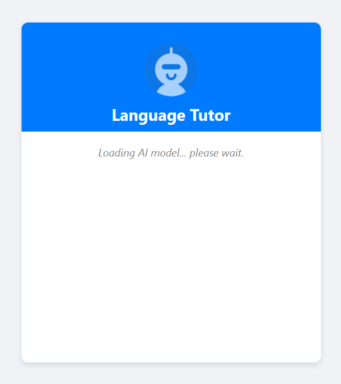

# Intel AI PC Web Language tutor with Transformers.js

This code sample demonstrates how to use Transformers.js and ONNX runtime to create Online Language Tutor on Intel AI PC.

This Language Tutor is available in two different versions:

1. Client-server web application where all the computation  on the server side
2. Client-server web application with all of the computation on the client side

both versions of the application share the following files:

* `index.html`
* `styles.css`
* `serviceWorker.js`
* images directory with `llm-avatar.png` and `user-avatar.png`

the only thing that needs to be updated is the path to the `script.js` file, for server computing to `/server/script.js`, and for local computing to `/local/script.js` in the `index.html` and `serviceWorker.js` files.

NOTE: This project is intended for demonstration and development purposes only. It is not production-ready.

## Installation steps

To run this code sample you need to have installed node and npm. Then, you need to install Web Sockets and Transformers.js, like below:

```bash
npm install ws
npm install @huggingface/transformers
```

## Run application

Serve application

``` bash
node server.js
```

then, go to `localhost:8080` in your browser and chat with model



## Images

Used images are part of Plump Interface Duotone Icons set on the  Creative Commons Attribution 4.0 International license.

Used icon set was designed by Streamline.
