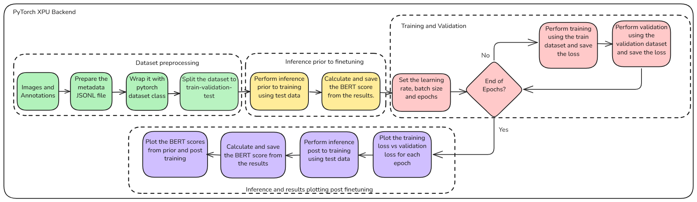
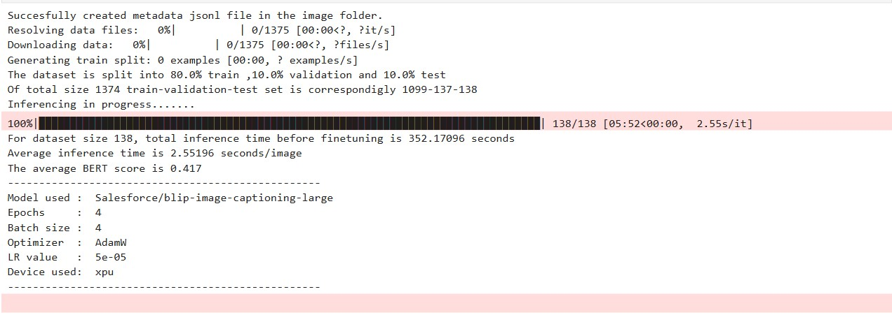
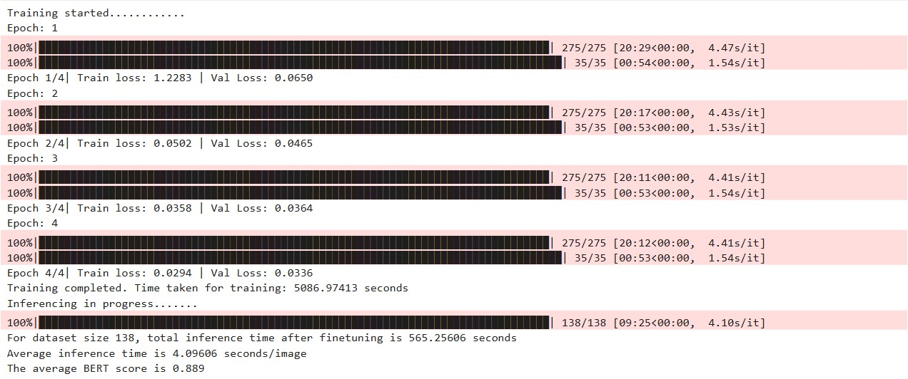
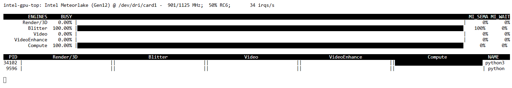

# Finetuning Image Caption Generation model using PyTorch XPU Backend

## Overview
Fine-tuning plays a pivotal role in improving model performance, especially for specialized tasks like image caption generation. In this example, we focus on fine-tuning the VL model [BLIP*large*](https://huggingface.co/Salesforce/blip-image-captioning-large) specifically for the **Hephaestus dataset**. By leveraging **PyTorch XPU** backend and **Intel XPUs**, this approach optimizes the fine-tuning process, allowing for enhanced performance and better adaptation to the dataset. Fine-tuning not only tailors the model to the specific task but also maximizes the efficiency and accuracy of the caption generation process, ensuring high-quality results from visual content.

## Contents

- [Sample Workflow](./README.md#sample-workflow)
- [Dataset](./README.md#sample-workflow)
- [Pre-requisites](./README.md#pre-requisites)
- [Structure of this directory](./README.md#Structure-of-this-directory)
- [Run the `finetune_image_captioning.ipynb` sample](./README.md#sample-structure)
   - [Using `uv`](./README.md#using-uv)
   - [AI PC from Intel](./README.md#ai-pc-from-intel)
- [Sample Execution](./README.md#sample-execution)


## Sample Workflow



## Dataset

The [Hephaestus dataset](https://github.com/Orion-AI-Lab/Hephaestus) is a large-scale multitask dataset designed to enhance the understanding of Interferometric Synthetic Aperture Radar (InSAR) data. This code sample leverages the data used in [Hephaestus: A large scale multitask dataset towards InSAR understanding](https://openaccess.thecvf.com/content/CVPR2022W/EarthVision/papers/Bountos_Hephaestus_A_Large_Scale_Multitask_Dataset_Towards_InSAR_Understanding_CVPRW_2022_paper.pdf) as published in CVPR 2022 workshop Earthvision. The dataset was created to address various computer vision problems related to geophysical processes and geology, particularly focusing on volcanoes. From the full collection of 19,919 InSAR images, we selected 1,374 images that each have unique captions, specifically for the fine-tuning task.

## Pre-requisites

| Optimized for                      | Description                                                                                                                                                                 |
| :----------------------------------| :---------------------------------------------------------------------------------------------------------------------------------------------------------------------------|
| OS                        | Windows 11 64-bit (22H2, 23H2) and newer or Ubuntu* 22.04 64-bit (with Linux kernel 6.6+) and newer                                                                                                                                                                                                              |
| Hardware                  | Intel® Core™ Ultra Processors, Intel Arc™ Graphics, or Intel Graphics, Intel® Data Center GPU Max Series                                                                                                                                                                                                         |
| Software                  | [Intel® GPU drivers from Intel® Arc™ & Iris® Xe Graphics for Windows](https://www.intel.com/content/www/us/en/download/785597/intel-arc-iris-xe-graphics-windows.html), [uv](https://docs.astral.sh/uv/)                                                                                                                                                                                       |
| Minimum RAM required      | 32 GB or more, with 18 GB discrete GPU (Arc series)                                                                                  |
| Optional                  | Monitor GPU Utilization using [Intel XPU Manager](https://github.com/intel/xpumanager)
                                                                                     


## Structure of this directory

    
This sample directory contains:

```
Finetue Image Captioning/
+-- Hephaestus_dataset                
¦   +-- images.zip                     # Contains the 1374 images for finetuning
¦   +-- annotations.zip                # Each annotations files contains the details about their respective image including their captioning. 

+-- assets/                            # Images and diagrams
¦   +-- loss_vs_epoch.png              # Plots training loss and validation loss for each epoch.
¦   +-- bertscore.png                  # Comparision of BERT Score Before vs After Training
¦   +-- results_before_training.csv    # Contains the generated caption, actual caption and their BERT score for images from the test set, prior to finetuning
¦   +-- results_after_training.csv     # Contains the generated caption, actual caption and their BERT score for images from the test set, post finetuning 

+-- finetune_image_captioning.ipynb    # Jupyter notebook to finetune a VL model for image captioning.

+-- README.md
+-- pyproject.toml
```


## Run the `Finetune Image Captioning` Sample:

### Using `uv`

The sample uses [uv](https://docs.astral.sh/uv/) for environment management. Steps to install `uv` can be found [here](https://docs.astral.sh/uv/getting-started/installation/). 

1. Log in to Hugging Face, generate a token, and download the required model:\
   `huggingface-cli` lets you interact directly with the Hugging Face Hub from a terminal. Log in to [Huggingface](https://huggingface.co/) with your credentials. You need a [User Access Token](https://huggingface.co/docs/hub/security-tokens) from your [Settings page](https://huggingface.co/settings/tokens). The User Access Token is used to authenticate your identity to the Hub.\
   Once you have your token, run the following command in your terminal.
   ```
   uv run huggingface-cli login
   ```
   This command will prompt you for a token. Copy-paste yours and press Enter.
   ```
   uv run huggingface-cli download Salesforce/blip-image-captioning-large
   ```

2. In a terminal, navigate to `Finetune-Image-Captioning` folder:
   ```bash
   cd <path/to/Finetune-Image-Captioning/folder>
   ```
   > NOTE: On Ubuntu, Install git-lfs before cloning the repository using the below commands:
   >
   > ```bash 
   > sudo apt-get install git-lfs
   > ```
   > ```bash
   > git lfs install
   > ```
   >```bash
   > git lfs track "*.zip"
   > ```
  
3. Launch Jupyter Notebook

   ```bash
   uv run jupyter-lab
   ```
   > **NOTE:** Run the below command if you face any dependency issues:
   > ```bash
   >   uv clean
   > ```

### AI PC from Intel
<div class="alert alert-block alert-info"> <b>NOTE:</b> You can run the step on both, <b>Windows and Ubuntu</b>. </div>

1. Open the [finetune_image_captioning.ipynb](./finetune_image_captioning.ipynb) notebook file in the jupyter notebook, select the default kernel i.e. `Python(ipykernel)` and run the code cells one by one in the notebook.

## Sample execution 
Users would be observing the below shown output by executing the cell for inferencing prior to finetuning.


Users would be observing the below shown output by executing the cell for training and inferencing post training.


Users would be observing GPU utilization as this sample runs is optimized to run on Intel XPUs


## Troubleshooting
- If you encounter incorrect path error while unzipping the `images.zip` and `annotations.zip` on Ubuntu, install git lfs using the below commands before cloning the repository:
```bash
sudo apt-get install git-lfs
```
```bash
git lfs install
```
```bash
git lfs track "*.zip"
```

## License

Code samples are licensed under the MIT license. See [License.txt](https://github.com/oneapi-src/oneAPI-samples/blob/master/License.txt) for details.

Third party program Licenses can be found here: [third-party-programs.txt](https://github.com/oneapi-src/oneAPI-samples/blob/master/third-party-programs.txt).
