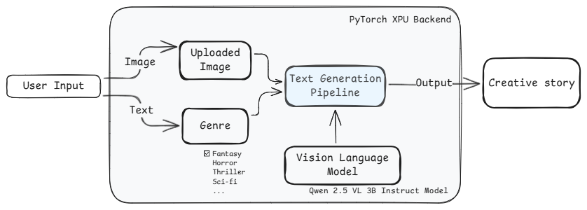
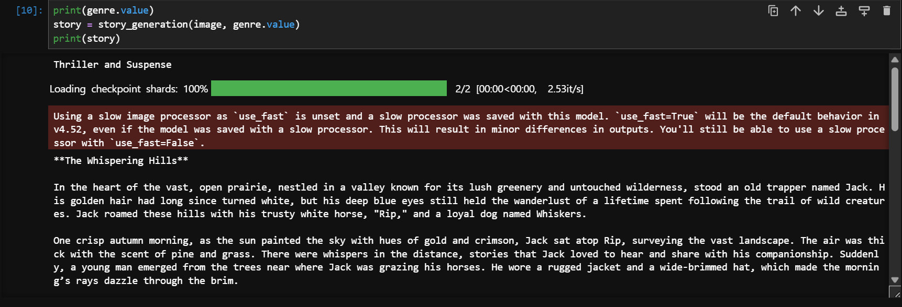

# Genre-Driven Storytelling from Images using PyTorch XPU backend
## Overview
This sample explores the generation of creative, genre-specific stories from images, specifically optimized for Intel hardware using the PyTorch XPU backend. 
The core of the sample lies in its ability to understand visual content through the VLM and then weave a story that adheres to the conventions and style of the selected genre. By utilizing the PyTorch XPU backend, this sample aims for efficient computation and accelerated story generation on Intel Arc GPUs and other compatible hardware.

## Contents

- [Sample Workflow](./Readme.md#sample-workflow)
- [Pre-requisites](./Readme.md#pre-requisites)
- [Sample structure](./Readme.md#sample-structure)
- [Run the `Genre-driven storytelling` Sample](./Readme.md#sample-structure)
   - [Using `uv`](./Readme.md#using-uv)
   - [AI PC from Intel](./Readme.md#ai-pc-from-intel)
   - [Intel® Tiber™ AI Cloud](./Readme.md#intel-tiber-ai-cloud)
- [Sample Execution](./Readme.md#sample-execution)

## Sample Workflow
It takes an image and a user-defined genre (e.g., fantasy, horror, romance, sci-fi) as input and leverages a Vision Language Model (VLM) to craft engaging narratives that are visually inspired and thematically aligned with the chosen genre.



## Pre-requisites

| Optimized for                      | Description                                                                                                                                                                 |
| :----------------------------------| :---------------------------------------------------------------------------------------------------------------------------------------------------------------------------|
| OS                        | Windows 11 64-bit (22H2, 23H2) and newer or Ubuntu* 22.04 64-bit (with Linux kernel 6.6+) and newer                                                                                                                                                                                                              |
| Hardware                  | Intel® Core™ Ultra Processors, Intel Arc™ Graphics, or Intel Graphics, Intel® Data Center GPU Max Series                                                                                                                                                                                                         |
| Software                  | [Intel® GPU drivers from Intel® Arc™ & Iris® Xe Graphics for Windows](https://www.intel.com/content/www/us/en/download/785597/intel-arc-iris-xe-graphics-windows.html), [uv](https://docs.astral.sh/uv/)                                                                                                                                                                                       |
| Minimum RAM required      | 32 GB or more                                                                                                                                                                        |
| Optional                  | Monitor GPU Utilization using [Intel XPU Manager](https://github.com/intel/xpumanager)
                                                                                     
## Sample Structure

This Sample directory contains:
| Notebook                           | Description                                                                                            |
| :--------------------------------- | :----------------------------------------------------------------------------------------------------- |
| [Genre-driven-storytelling.ipynb](./Genre-driven-storytelling.ipynb) | Enables faster and affordable company logo generation using language and diffusion models with the help of automated prompt engineering  |


## Run the `Automated Logo Generation` Sample:
## Installing Prerequisites && Setting Up the Environment

### For Windows:
To install any software using commands, Open the Command Prompt as an administrator by right-clicking the terminal icon and selecting `Run as administrator`.
1. **GPU Drivers installation**\
   Download and install the Intel® Graphics Driver for Intel® Arc™ B-Series, A-Series, Intel® Iris® Xe Graphics, and Intel® Core™ Ultra Processors with Intel® Arc™ Graphics from [here](https://www.intel.com/content/www/us/en/download/785597/intel-arc-iris-xe-graphics-windows.html)\
   **IMPORTANT:** Reboot the system after the installation.

2. **Git for Windows**\
   Download and install Git from [here](https://git-scm.com/downloads/win)

3. **uv for Windows**\
   Steps to install `uv` in the Command Prompt are as follows. Please refer to the [documentation](https://docs.astral.sh/uv/getting-started/installation/) for more information.
   ```
   powershell -ExecutionPolicy ByPass -c "irm https://astral.sh/uv/install.ps1 | iex"
   ```
   **NOTE:** Close and reopen the Command Prompt to recognize uv.
   
### For Linux:
To install any software using commands, Open a new terminal window by right-clicking the terminal and selecting `New Window`.
1. **GPU Drivers installation**\
   Download and install the GPU drivers from [here](https://dgpu-docs.intel.com/driver/client/overview.html)

2. **Dependencies on Linux**\
   Install Curl, Wget, Git using the following commands:
   - For Debian/Ubuntu-based systems:
   ```
   sudo apt update && sudo apt -y install curl wget git
   ```
   - For RHEL/CentOS-based systems:
   ```
   sudo dnf update && sudo dnf -y install curl wget git
   ```

3. **uv for Linux**\
   Steps to install uv are as follows. Please refer to the [documentation](https://docs.astral.sh/uv/getting-started/installation/) for more information.
   - If you want to use curl to download the script and execute it with sh:
   ```
   curl -LsSf https://astral.sh/uv/install.sh | sh
   ```
   - If you want to use wget to download the script and execute it with sh:
   ```
   wget -qO- https://astral.sh/uv/install.sh | sh
   ```
   **NOTE:** Close and reopen the Terminal to recognize uv.

---


## Run the `Genre-driven Storytelling` Sample:

1. Navigate to the sample directory:
   ```bash
   cd <path/to/Genre-driven-storytelling/folder>
   ```
   
2. Log in to Hugging Face, generate a token, and download the required model:\
   `huggingface-cli` lets you interact directly with the Hugging Face Hub from a terminal. Log in to [Huggingface](https://huggingface.co/) with your credentials. You need a [User Access Token](https://huggingface.co/docs/hub/security-tokens) from your [Settings page](https://huggingface.co/settings/tokens). The User Access Token is used to authenticate your identity to the Hub.\
   Once you have your token, run the following command in your terminal.
   ```
   uv run huggingface-cli login
   ```
   This command will prompt you for a token. Copy-paste yours and press Enter.
   ```
   uv run huggingface-cli download Qwen/Qwen2.5-VL-3B-Instruct
   ```
   
3. Launch Jupyter Notebook
   ```bash
   uv run jupyter lab
   ```
   > If you face any dependencies issues, please clean your uv environment and try again
   > ```bash
   > uv clean
   > ```

### AI PC from Intel
<div class="alert alert-block alert-info"> <b>NOTE:</b> You can run the step on both, <b>Windows and Ubuntu</b>. </div>

1. Open the [Genre driven storytelling](./Genre-driven-storytelling.ipynb) notebook file in the jupyter notebook, select the default kernel i.e. `Python(ipykernel)` and run the code cells one by one in the notebook.

### Intel Tiber AI Cloud
1. Follow these steps in a new terminal session. Create and select the `uv_env` Jupyter kernel to get access to required python packages in the notebook.
   ```
   uv sync
   uv run python -m ipykernel install --user --name=uv_env --display-name="uv_env"
   ```

2. Open the [Automated Logo Generation](./Automated_Logo_Generation.ipynb) notebook file in the jupyter notebook, select the `uv_env` environment.

## Sample Execution
GPU utilization would be observed as this sample is optimized to run on Intel XPUs.


### Creative story generation using Vision-language models




