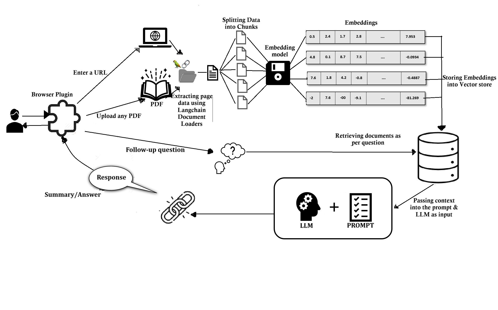

# Text summarizer browser Plugin Sample

A plug-and-play Chrome extension seamlessly integrates with Flask and leverages an OpenVINO backend for fast and efficient summarization of webpages (via URL) and PDFs (via upload). Powered by LangChain tools, it handles advanced tasks like text splitting and vectorstore management to deliver accurate and meaningful summaries.

## How it Works



## Sample Structure

The directory contains:
- **backend:** Includes `code.py` and `server.py` for processing text from webpages or PDFs and managing Flask-related operations.
- **extension:** Contains `manifest.json` for the Chrome extension along with `popup.html`, `popup.js`, and `style.css` for the user interface.

## Prerequisites

| Optimized for | Description                                                                                                                                                                                      |
| :------------ | :----------------------------------------------------------------------------------------------------------------------------------------------------------------------------------------------- |
| OS            | Windows 11 64-bit (22H2, 23H2) and newer or Ubuntu* 22.04 64-bit (with Linux kernel 6.6+) and newer                                                                                              |
| Hardware      | Intel® Core™ Ultra Processors                                                                                                                                                                              |
| Software      | 1. [Intel® GPU drivers from Intel® Arc™ & Iris® Xe Graphics for Windows](https://www.intel.com/content/www/us/en/download/785597/intel-arc-iris-xe-graphics-windows.html) or [Linux GPU drivers](https://dgpu-docs.intel.com/driver/client/overview.html) <br> 2. NPU(Optional): [Intel® NPU Driver for Windows](https://www.intel.com/content/www/us/en/download/794734/intel-npu-driver-windows.html) or [Linux NPU Driver](https://github.com/intel/linux-npu-driver/releases)  |
| Browsers      | [Google Chrome](https://www.google.com/chrome/dr/download/?brand=MRUS&ds_kid=43700079286123654&gad_source=1&gclid=EAIaIQobChMI0J3fybvSigMV5dXCBB1TDARCEAAYASAAEgL36_D_BwE&gclsrc=aw.ds) & [Microsoft Edge](https://www.microsoft.com/en-us/edge/download?form=MA13FJ)


1. **Install the below necessary tools/packages:**
   - Git
       - [Git for Windows](https://git-scm.com/downloads)
       - Git for Linux
         ```bash
         sudo apt update && sudo apt install git
         ```
   - Miniforge
       - [Miniforge for Windows](https://conda-forge.org/download/)
       - Miniforge for Linux
         Download, install the Miniconda using the below commands. 
            ```bash
            wget "https://github.com/conda-forge/miniforge/releases/latest/download/Miniforge3-$(uname)-$(uname -m).sh"
            bash Miniforge3-$(uname)-$(uname -m).sh
            cd </move/to/miniforge3/bin/folder> 
            ./conda init 
            ```
            Replace </move/to/miniforge3/bin/folder> with your actual Miniforge bin folder path and run the cd command to go there. Initialize the conda environment and restart the terminal.


2. **Create a Conda Environment:**
   - Run the command:
     ```bash
     conda create -n summarizer_plugin python=3.11 libuv
     ```
     ```bash
     conda activate summarizer_plugin
     ```


3. **Install Dependencies:**
   - Execute:
     ```bash
     pip install -r requirements.txt
     ```
     
4. **Install an ipykernel to select the "summarizer_plugin" environment:**
     ```bash
     python -m ipykernel install --user --name=summarizer_plugin
     ```
     
     >**Note**: Run your terminal as admin to avoid any permission issues.

     
## Next Steps
Below are the steps to run the plugin from Jupyter Notebook **OR** Terminal.

### **Steps to follow via Jupyter Notebook:**
Once the environment is created, we can run the plugin via [TextSummarizerPlugin.ipynb](./TextSummarizerPlugin.ipynb). Please follow the below steps to open the jupyter notebook:
1. Open Jupyter Notebook & run the cells:
   ```
   jupyter notebook
   ```
2. Select the **summarizer_plugin** kernel.

### **Steps to follow via Terminal:**
1. **Download and Convert the Huggingface Model to OpenVINO IR Format:**
   - Log in to Huggingface:
     ```
     huggingface-cli login
     ```
   - Generate a token from Huggingface. For private or gated models, refer to [Huggingface documentation](https://huggingface.co/docs/hub/en/models-gated).
   - Convert the model using `optimum-cli`by creating a directory named **models** and saving the models inside it:
     ```
     mkdir models
     cd models
     optimum-cli export openvino --model meta-llama/Llama-2-7b-chat-hf --weight-format int4 ov_llama_2
     optimum-cli export openvino --model Qwen/Qwen2-7B-Instruct --weight-format int4 ov_qwen7b
     
     ```
     >**Note**: [Raise access request](https://www.llama.com/llama-downloads) for Llama models as it is a gated repository.

     

2. **Load the Extension:**
   - To load an unpacked extension in developer mode:
        - Go to the Extensions page by entering **chrome://extensions** in a new tab. (By design chrome:// URLs are not linkable.)
             - Alternatively, **click the Extensions menu puzzle button and select Manage Extensions** at the bottom of the menu.
             - Or, click the Chrome menu, hover over More Tools, then select Extensions.
        - Enable **Developer Mode** by clicking the toggle switch next to Developer mode.
        - Click the **Load unpacked** button and select the extension directory.
        - Refer to [Chrome’s development documentation](https://developer.chrome.com/docs/extensions/get-started/tutorial/hello-world#load-unpacked) for further details.
     
     
     


3. **Pin the Extension:**

   Pin your extension to the toolbar to quickly access your extension.
   
   
   


#### Steps to Run the Plugin

1. **Start the Flask Server:**
   - Navigate to the backend folder:
     ```
     cd Text-Summarizer/backend
     python server.py
     ```

2. **Open the Chrome Browser:**
   - Activate & Pin the loaded extension.
   - Plugin UI looks as follows:

      

   
3. **Select an OpenVINO Model:**
   - Choose an OpenVINO IR format model previously converted from Huggingface.

     


4. **Interact with the UI:**
   - Choose either **Web Page** or **PDF** post selecting one of the converted OV models:

     


     - **Web Summarizer:**
       1. Enter the URL of the webpage to summarize.
       2. Click the "Summarize" button.
       3. After summarization, the text appears, and users can ask follow-up questions.

          


     - **PDF Summarizer:**
       1. Upload a PDF file.
       2. Click "Upload & Summarize."
       3. After summarization, the text appears, and users can ask additional questions.

          
      
       4. Sample output post summarization.
          
          


5. **Reload the Page:**  
   - Refresh the webpage or re-open the plugin to restart.
