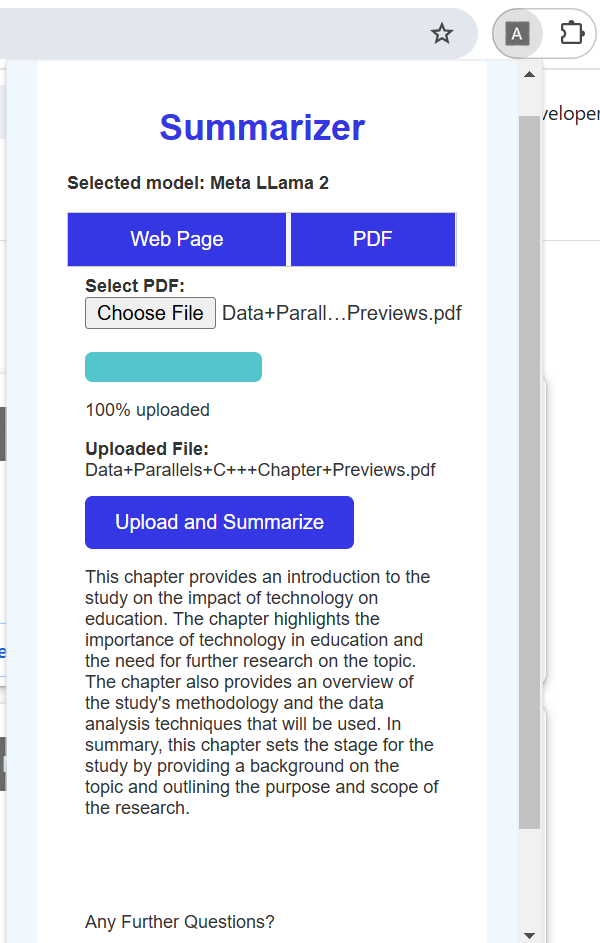

# Text Summarizer Browser Plugin

A plug-and-play Chrome extension that integrates seamlessly with a Flask backend, leveraging OpenVINO for fast and efficient summarization of webpages (via URL) and PDFs (via upload). Powered by LangChain tools, it handles advanced tasks like text splitting and vector store management to deliver accurate and meaningful summaries.

---

## Table of Contents
- [Overview](#overview)
- [Architecture](#architecture)
- [Prerequisites](#prerequisites)
- [Project Structure](#project-structure)
- [Setup & Installation](#setup--installation)
  - [Environment Setup](#environment-setup)
  - [Model Preparation](#model-preparation)
  - [Running the Backend](#running-the-backend)
  - [Loading the Chrome Extension](#loading-the-chrome-extension)
- [Usage](#usage)
  - [Webpage Summarization](#webpage-summarization)
  - [PDF Summarization](#pdf-summarization)
- [Troubleshooting](#troubleshooting)
- [License](#license)

---

## Overview

This project provides a minimalist Chrome extension that allows users to summarize the content of any webpage or PDF directly from their browser. The extension communicates with a FastAPI server, which performs the summarization using OpenVINO-optimized models and LangChain utilities.

## Architecture

- **Chrome Extension:** User interface for input (webpage URL or PDF upload) and displaying summaries.
- **FastAPI Server:** Backend for processing requests, running summarization models, and returning results.
- **OpenVINO & LangChain:** Accelerated inference and advanced text processing.


---

## Prerequisites

| Component   | Details |
|-------------|-------------|
| OS          | Windows 11 64-bit (22H2, 23H2+) or Ubuntu 22.04 64-bit (kernel 6.6+)|
| Hardware    | Intel® GPU (Arc™ & Iris® Xe) drivers ([Windows](https://www.intel.com/content/www/us/en/download/785597/intel-arc-iris-xe-graphics-windows.html) / [Linux](https://dgpu-docs.intel.com/driver/client/overview.html)), NPU (optional: [Windows](https://www.intel.com/content/www/us/en/download/794734/intel-npu-driver-windows.html) / [Linux](https://github.com/intel/linux-npu-driver/releases)), Intel® Core™ Ultra Processors |
| Software    | [uv](https://docs.astral.sh/uv/)|
| Browsers    | [Google Chrome](https://www.google.com/chrome/) or [Microsoft Edge](https://www.microsoft.com/en-us/edge/download)|

---

## Project Structure

```
Text-Summarizer-Browser-Plugin/
├── backend/                # FastAPI server and model code
│   ├── code.py
│   ├── server.py
│   └── ...
├── extension/              # Chrome extension files
│   ├── manifest.json
│   ├── popup.html
│   ├── popup.js
│   └── style.css
├── models/                 # OpenVINO IR models
│   └── ...
├── assets/                 # Images and diagrams
├── TextSummarizerPlugin.ipynb # Jupyter notebook for running the backend
├── README.md
└── pyproject.toml
```

---

## Setup & Installation

### Environment Setup

1. **Install `uv`** ([docs](https://docs.astral.sh/uv/getting-started/installation/)):
   - **Windows:**
     ```sh
     powershell -ExecutionPolicy ByPass -c "irm https://astral.sh/uv/install.ps1 | iex"
     ```
   - **Linux:**
     ```sh
     curl -LsSf https://astral.sh/uv/install.sh | sh
     # or
     wget -qO- https://astral.sh/uv/install.sh | sh
     ```
2. **Install dependencies:**
   ```sh
   uv sync
   # If you encounter issues:
   uv clean
   ```

### Model Preparation

1. **Login to Huggingface:**
   ```sh
   uv huggingface-cli login
   ```
2. **Export models to OpenVINO IR format:**
   ```sh
   mkdir models
   cd models
   uv run optimum-cli export openvino --model meta-llama/Llama-2-7b-chat-hf --weight-format int4 ov_llama_2
   uv run optimum-cli export openvino --model Qwen/Qwen2-7B-Instruct --weight-format int4 ov_qwen7b
   ```
   > **Note:** Llama models require [access approval](https://www.llama.com/llama-downloads).

### Running the Backend

- **Via Jupyter Notebook:**
  1. Launch Jupyter Lab:
     ```sh
     uv run jupyter lab
     ```
  2. Open `TextSummarizerPlugin.ipynb` and run all cells.

- **Via Terminal:**
  1. Start the FastAPI server:
     ```sh
     cd backend
     uv run fastapi dev server.py --port 5000
     ```

### Loading the Chrome Extension

1. Open Chrome and navigate to `chrome://extensions`.
2. Enable **Developer Mode**.
3. Click **Load unpacked** and select the `extension` directory.

4. Pin the extension for quick access.

---

## Usage

### Webpage/PDF Summarization
1. Click the extension icon in Chrome.
2. Select an OpenVINO model.
3. Choose **Web Page** or **PDF** mode.
4. Enter the URL or upload a PDF, and click **Summarize**.
5. View the summary and ask follow-up questions.



---

## Troubleshooting
- **Dependency Issues:** Run `uv clean` and then `uv sync`.
- **Model Access:** Ensure you have the correct Huggingface access tokens for gated models.
- **Extension Not Loading:** Make sure you select the correct `extension` directory and enable Developer Mode in Chrome.

---

## License

This project is licensed under the MIT License. See [LICENSE](LICENSE) for details.
