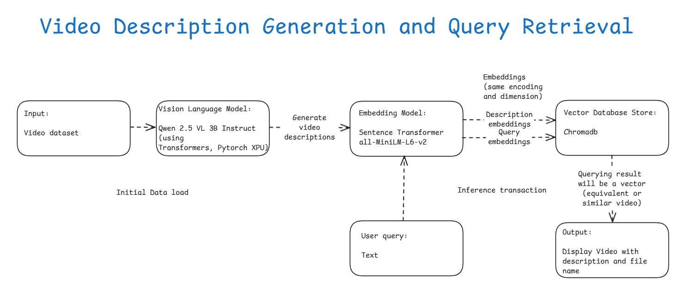
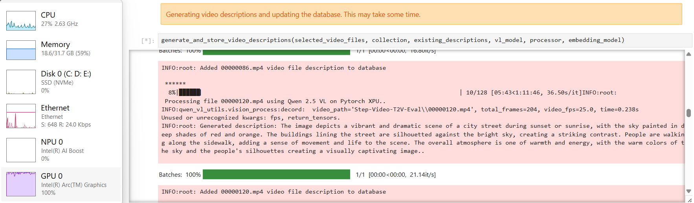
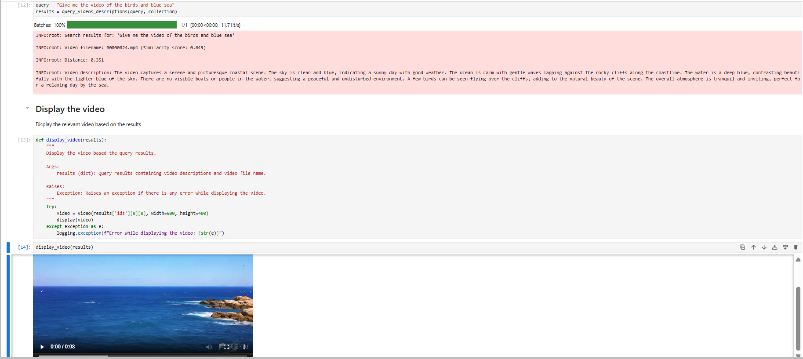

# Video Description Generation and Query Retrieval
## Introduction

This sample demonstrates how to generate video descriptions using the [**Qwen 2.5 Vision-Language model**](https://github.com/QwenLM/Qwen2.5-VL) and store their embeddings in [**ChromaDB**](https://www.trychroma.com/) for efficient semantic search on **Intel® Core™ Ultra Processors**. The Qwen 2.5 Vision-Language model is loaded using the [**PyTorch XPU backend**](https://docs.pytorch.org/docs/stable/notes/get_start_xpu.html) to leverage Intel hardware acceleration.\
For each video, a description is generated and stored as an embedding in ChromaDB. When a user submits a query, cosine similarity search is performed in ChromaDB to retrieve the most relevant video description. The matching video is then displayed inline.\
This sample uses the videos from the [**stepfun-ai/Step-Video-T2V-Eval**](https://huggingface.co/datasets/stepfun-ai/Step-Video-T2V-Eval) Hugging Face dataset. For more information on the dataset and citation requirements, please refer to the [**Step-Video-T2V Technical Report paper**](https://arxiv.org/abs/2502.10248).

---

## Table of Contents

- [Architecture](#architecture)
- [Project Structure](#project-structure)
- [Dataset Details](#dataset-details)
- [Prerequisites](#prerequisites)
- [Installing Prerequisites && Setting Up the Environment](#installing-prerequisites--setting-up-the-environment)
   - [For Windows](#for-windows)
   - [For Linux](#for-linux)
- [Running the Sample && execution output](#running-the-sample--execution-output)
- [Troubleshooting](#troubleshooting)
- [Dataset Citations](#dataset-citations)
- [License](#license)

---

## Architecture

- During the initial data load, videos from the [Step-Video-T2V-Eval](https://huggingface.co/datasets/stepfun-ai/Step-Video-T2V-Eval) Hugging Face dataset is fed into the [Qwen 2.5 Vision-Language model](https://github.com/QwenLM/Qwen2.5-VL).
- Here, the [Qwen2.5-VL-3B-Instruct](https://huggingface.co/Qwen/Qwen2.5-VL-3B-Instruct) model variant is used to process these videos and generate descriptions. The Qwen 2.5 Vision-Language model is loaded using the [PyTorch XPU backend](https://docs.pytorch.org/docs/stable/notes/get_start_xpu.html) to leverage Intel hardware acceleration.
- Next, the generated video descriptions are converted into embeddings using [Sentence Transformers](https://sbert.net/), with the [all-MiniLM-L6-v2 model](https://huggingface.co/sentence-transformers/all-MiniLM-L6-v2).
- These embeddings, along with the descriptions and video metadata, are stored in a persistent local [ChromaDB](https://www.trychroma.com/) collection. This is a one-time operation; since ChromaDB is local and persistent, it does not need to be repeated unless new videos are added.
- When a user submits a query, the text is similarly encoded into an embedding, which is then used to perform a semantic search (via cosine similarity) over the ChromaDB collection.
- The final result will be the most relevant video description and its associated video file name, and the video is displayed directly in the notebook.



---

## Project Structure

    Video-Description-Generation-Query-Retrieval/                          # Project Sample folder
    ├── assets/                                                            # Assets folder which contains the images and diagrams
    │   ├── Generating_video_descriptions_using_Pytorch_XPU.png            # Output screenshot image 1
    │   ├── Video_description_generation_and_query_retrieval_workflow.jpg  # Workflow image
    │   └── Video_display.png                                              # Output screenshot image 2
    ├── Readme.md                                                          # Readme file which contains all the details and instructions about the project sample
    ├── Video_Description_Generation_Query_Retrieval.ipynb                 # Notebook file to excute the project sample
    ├── pyproject.toml                                                     # Requirements for the project sample
    └── uv.lock                                                            # File which captures the packages installed for the project sample

---

## Dataset Details

In this project sample, we are going to use [Step-Video-T2V-Eval](https://huggingface.co/datasets/stepfun-ai/Step-Video-T2V-Eval) Hugging Face dataset which has **128 videos**. 
Step-Video-T2V Eval benchmark features 128 prompts. This benchmark is designed to evaluate the quality of generated videos across **11 distinct categories**.
They are Sports, Food, Scenery, Animals, Festivals, Combination Concepts, Surreal, People, 3D Animation, Cinematography, and Style.

Please find the some of the keywords below used in the prompts across 11 different categories.

**Sports** --> *Soccer, basketball, tennis, running, badminton, table tennis, Dumbells lifting, Golf, Skateboard, skiers gliding, Water surfer, sand pit jump.*\
**Food** --> *Sliced meat, French roast, Spaghetti, Sushi, Naan with Chicken, Taco, Pad thai, Fish with vegetables, Grilled kebab, Burgers, Kebab.*\
**Scenery** --> *Mountains, Blue ocean, Waterfall, Towers, Kremlin wall, Sailboat, Buildings, Modern city, sunset, river, hills.*\
**Animals** --> *Lion, Dog, Birds, Dolphins, Elephant, sharks, Snake, Butterfly, Kangaroo, penguins, cheetah, Kitten.*\
**Festivals** --> *Christmas, lantern, Halloween.*\
**Combination concepts, Surreal, People, 3D Animation, Cinematography, Style**

---

## Prerequisites

|    Component   |   Recommended   |
|   ------   |   ------   |
|   Operating System(OS)   |   Windows 11 or later/ Ubuntu 20.04 or later   |
|   Random-access memory(RAM)   |   32 GB   |
|   Hardware   |   Intel® Core™ Ultra Processors, Intel Arc™ Graphics, Intel Graphics, Intel® Xeon® Processor, Intel® Data Center GPU Max Series   |

---

## Installing Prerequisites && Setting Up the Environment

### For Windows:
To install any software using commands, Open the Command Prompt as an administrator by right-clicking the terminal icon and selecting `Run as administrator`.
1. **GPU Drivers installation**\
   Download and install the Intel® Graphics Driver for Intel® Arc™ B-Series, A-Series, Intel® Iris® Xe Graphics, and Intel® Core™ Ultra Processors with Intel® Arc™ Graphics from [here](https://www.intel.com/content/www/us/en/download/785597/intel-arc-iris-xe-graphics-windows.html)\
   **IMPORTANT:** Reboot the system after the installation.

2. **Git for Windows**\
   Download and install Git from [here](https://git-scm.com/downloads/win)

3. **uv for Windows**\
   Steps to install `uv` in the Command Prompt are as follows. Please refer to the [documentation](https://docs.astral.sh/uv/getting-started/installation/) for more information.
   ```
   powershell -ExecutionPolicy ByPass -c "irm https://astral.sh/uv/install.ps1 | iex"
   ```
   **NOTE:** Close and reopen the Command Prompt to recognize uv.
   
### For Linux:
To install any software using commands, Open a new terminal window by right-clicking the terminal and selecting `New Window`.
1. **GPU Drivers installation**\
   Download and install the GPU drivers from [here](https://dgpu-docs.intel.com/driver/client/overview.html)

2. **Dependencies on Linux**\
   Install Curl, Wget, Git using the following commands:
   - For Debian/Ubuntu-based systems:
   ```
   sudo apt update && sudo apt -y install curl wget git
   ```
   - For RHEL/CentOS-based systems:
   ```
   sudo dnf update && sudo dnf -y install curl wget git
   ```

3. **uv for Linux**\
   Steps to install uv are as follows. Please refer to the [documentation](https://docs.astral.sh/uv/getting-started/installation/) for more information.
   - If you want to use curl to download the script and execute it with sh:
   ```
   curl -LsSf https://astral.sh/uv/install.sh | sh
   ```
   - If you want to use wget to download the script and execute it with sh:
   ```
   wget -qO- https://astral.sh/uv/install.sh | sh
   ```
   **NOTE:** Close and reopen the Terminal to recognize uv.

---

## Running the Sample && execution output
   
1. In the Command Prompt/terminal, navigate to `Video-Description-Generation-Query-Retrieval` folder after cloning the sample:
   ```
   cd <path/to/Video-Description-Generation-Query-Retrieval/folder>
   ```
   
2. Log in to Hugging Face, generate a token, and download the required models and datasets:\
   `huggingface-cli` lets you interact directly with the Hugging Face Hub from a terminal. Log in to [Huggingface](https://huggingface.co/) with your credentials. You need a [User Access Token](https://huggingface.co/docs/hub/security-tokens) from your [Settings page](https://huggingface.co/settings/tokens). The User Access Token is used to authenticate your identity to the Hub.\
   Once you have your token, run the following command in your terminal.
   ```
   uv run huggingface-cli login
   ```
   This command will prompt you for a token. Copy-paste yours and press Enter.
   ```
   uv run huggingface-cli download Qwen/Qwen2.5-VL-3B-Instruct
   uv run huggingface-cli download sentence-transformers/all-MiniLM-L6-v2
   uv run huggingface-cli download stepfun-ai/Step-Video-T2V-Eval --repo-type dataset --local-dir ./Step-Video-T2V-Eval
   ```

3. Launch Jupyter Lab and Run the notebook:\
   Open the [Video Description Generation Query Retrieval](./Video_Description_Generation_Query_Retrieval.ipynb) notebook in the Jupyter Lab.
   - In the Jupyter Lab go to the kernel menu in the top-right corner of the notebook interface and choose default kernel i.e. `Python 3 (ipykernel)` from the available kernels list and run the code cells one by one in the notebook.
   ```
   uv run jupyter lab
   ```
   - If you are running the sample in the [Intel Tiber AI Cloud(ITAC)](https://ai.cloud.intel.com/), follow these steps in a new terminal session. Create and select the `uv_env` Jupyter kernel to get access to required python packages in the notebook.
   ```
   uv sync
   uv run python -m ipykernel install --user --name=uv_env --display-name="uv_env"
   ```

4. GPU utilization can be seen in the Task Manager while generating video descriptions for videos which are processing on Intel XPUs.
   

5. Relevant video will be displayed based on user query.
   

---

## Troubleshooting

- **Dependency Issues:** Run `uv clean` and then `uv sync`.
- **File Access Issues:** Restart the kernel and run the cells again.

---

## Dataset Citations

    @misc{ma2025stepvideot2vtechnicalreportpractice,  
      title={Step-Video-T2V Technical Report: The Practice, Challenges, and Future of Video Foundation Model}, 
      author={Guoqing Ma and Haoyang Huang and Kun Yan and Liangyu Chen and Nan Duan and Shengming Yin and Changyi Wan and Ranchen Ming and Xiaoniu Song and Xing Chen and Yu Zhou and Deshan Sun and Deyu Zhou and Jian Zhou and Kaijun Tan and Kang An and Mei Chen and Wei Ji and Qiling Wu and Wen Sun and Xin Han and Yanan Wei and Zheng Ge and Aojie Li and Bin Wang and Bizhu Huang and Bo Wang and Brian Li and Changxing Miao and Chen Xu and Chenfei Wu and Chenguang Yu and Dapeng Shi and Dingyuan Hu and Enle Liu and Gang Yu and Ge Yang and Guanzhe Huang and Gulin Yan and Haiyang Feng and Hao Nie and Haonan Jia and Hanpeng Hu and Hanqi Chen and Haolong Yan and Heng Wang and Hongcheng Guo and Huilin Xiong and Huixin Xiong and Jiahao Gong and Jianchang Wu and Jiaoren Wu and Jie Wu and Jie Yang and Jiashuai Liu and Jiashuo Li and Jingyang Zhang and Junjing Guo and Junzhe Lin and Kaixiang Li and Lei Liu and Lei Xia and Liang Zhao and Liguo Tan and Liwen Huang and Liying Shi and Ming Li and Mingliang Li and Muhua Cheng and Na Wang and Qiaohui Chen and Qinglin He and Qiuyan Liang and Quan Sun and Ran Sun and Rui Wang and Shaoliang Pang and Shiliang Yang and Sitong Liu and Siqi Liu and Shuli Gao and Tiancheng Cao and Tianyu Wang and Weipeng Ming and Wenqing He and Xu Zhao and Xuelin Zhang and Xianfang Zeng and Xiaojia Liu and Xuan Yang and Yaqi Dai and Yanbo Yu and Yang Li and Yineng Deng and Yingming Wang and Yilei Wang and Yuanwei Lu and Yu Chen and Yu Luo and Yuchu Luo and Yuhe Yin and Yuheng Feng and Yuxiang Yang and Zecheng Tang and Zekai Zhang and Zidong Yang and Binxing Jiao and Jiansheng Chen and Jing Li and Shuchang Zhou and Xiangyu Zhang and Xinhao Zhang and Yibo Zhu and Heung-Yeung Shum and Daxin Jiang},
      year={2025},
      eprint={2502.10248},
      archivePrefix={arXiv},
      primaryClass={cs.CV},
      url={https://arxiv.org/abs/2502.10248}, 
      }

---

## License

This project is licensed under the MIT License. See [LICENSE](../LICENSE) for details.
